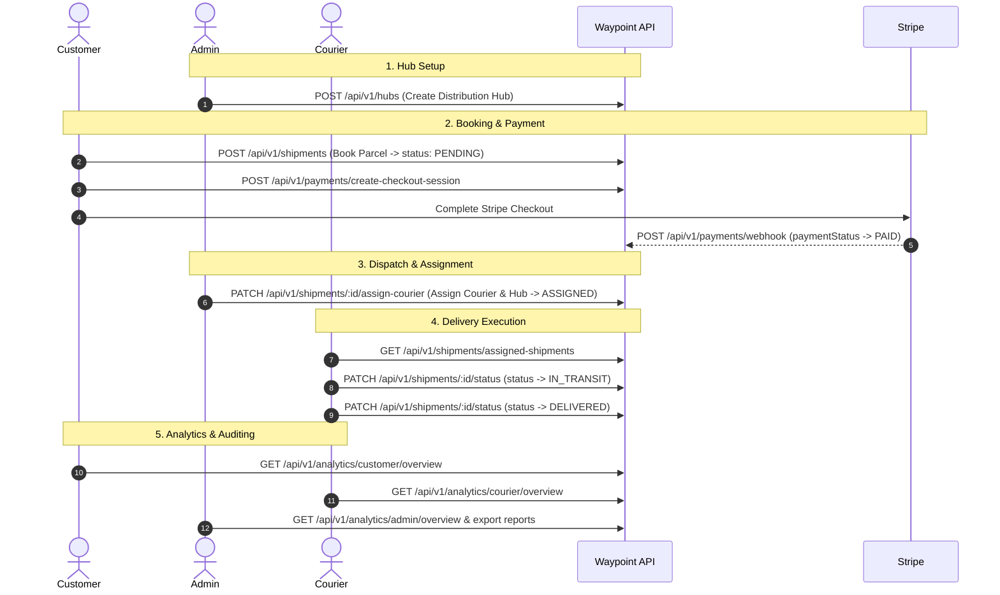

# 🔄 Waypoint — Complete End-to-End Workflow & Testing Guide

This guide provides an end-to-end walkthrough of the Waypoint delivery and logistics platform lifecycle. It details how the three user roles (**Customer**, **Courier**, and **Admin**) interact across parcel booking, Stripe payments, automated dispatching, delivery execution, and business reporting.

---

## 🗺 System Lifecycle Overview



---

## 🚀 Step-by-Step Testing Workflow

### Step 1: Authentication & Role Setup
Register or log in as each user role to obtain your `accessToken`. Include the token in subsequent requests as `Authorization: Bearer <token>`.

- **Register as Customer (Default Role)**:
  - `POST /api/v1/auth/register`
  - Body:
    ```json
    {
      "name": "John Customer",
      "email": "customer@waypoint.com",
      "password": "Password123!",
      "role": "CUSTOMER"
    }
    ```
- **Register as Courier (Role Option)**:
  - `POST /api/v1/auth/register`
  - Body:
    ```json
    {
      "name": "Dave Courier",
      "email": "courier@waypoint.com",
      "password": "Password123!",
      "role": "COURIER"
    }
    ```
- **Customer Login**:
  - `POST /api/v1/auth/login`
  - Body: `{ "email": "customer@waypoint.com", "password": "Password123!" }`
- **Courier Login**:
  - `POST /api/v1/auth/login`
  - Body: `{ "email": "courier@waypoint.com", "password": "Password123!" }`
- **Admin Login**:
  - `POST /api/v1/auth/login`
  - Body: `{ "email": "admin@waypoint.com", "password": "Password123!" }`

---

### Step 2: [Admin] Setup Logistics Distribution Hub
Create a regional distribution hub where parcels are routed and managed.

- **Endpoint**: `POST /api/v1/hubs`
- **Headers**: `Authorization: Bearer <ADMIN_TOKEN>`
- **Request Body**:
  ```json
  {
    "name": "Central Hub Dhaka",
    "address": "Banani, Dhaka 1213"
  }
  ```
- **Result**: Hub record is created. Save the returned `data.id` as `hubId`.

---

### Step 3: [Customer] Book Parcel & Complete Payment
1. **Book Shipment**:
   - **Endpoint**: `POST /api/v1/shipments`
   - **Headers**: `Authorization: Bearer <CUSTOMER_TOKEN>`
   - **Request Body**:
     ```json
     {
       "receiverName": "Rahim Ahmed",
       "receiverPhone": "01712345678",
       "weightKg": 3.5
     }
     ```
   - **Result**: Parcel created with auto-generated tracking number, initial `status: PENDING`, and `paymentStatus: UNPAID`. Save the returned `data.id` as `shipmentId`.

2. **Initiate Stripe Checkout**:
   - **Endpoint**: `POST /api/v1/payments/create-checkout-session`
   - **Headers**: `Authorization: Bearer <CUSTOMER_TOKEN>`
   - **Request Body**:
     ```json
     {
       "shipmentId": "<shipmentId>"
     }
     ```
   - **Result**: Returns a Stripe hosted checkout URL.
   - **Payment Confirmation**: Complete checkout via the Stripe page or simulate the event via the webhook:
     - `POST /api/v1/payments/webhook` with event `checkout.session.completed`
     - Shipment `paymentStatus` transitions automatically from `UNPAID` ➔ `PAID`.

---

### Step 4: [Admin] Dispatch & Assign Courier
Assign an active courier and regional hub to the pending shipment.

- **Endpoint**: `PATCH /api/v1/shipments/:id/assign-courier`
- **Headers**: `Authorization: Bearer <ADMIN_TOKEN>`
- **URL Parameter**: `:id` = `<shipmentId>`
- **Request Body**:
  ```json
  {
    "courierId": "<courierId>",
    "hubId": "<hubId>"
  }
  ```
- **Validation**: Verifies that `courierId` belongs to a user with `role = COURIER`.
- **Result**: Shipment status automatically transitions from `PENDING` ➔ `ASSIGNED`.

---

### Step 5: [Courier] Pick Up & Deliver Parcel
1. **View Assigned Shipments**:
   - **Endpoint**: `GET /api/v1/shipments/assigned-shipments`
   - **Headers**: `Authorization: Bearer <COURIER_TOKEN>`
   - **Result**: Returns only shipments where `courierId` matches the authenticated courier.

2. **Start Transit**:
   - **Endpoint**: `PATCH /api/v1/shipments/:id/status`
   - **Headers**: `Authorization: Bearer <COURIER_TOKEN>`
   - **URL Parameter**: `:id` = `<shipmentId>`
   - **Request Body**:
     ```json
     {
       "status": "IN_TRANSIT"
     }
     ```
   - **Result**: Shipment status updates to `IN_TRANSIT`.

3. **Complete Delivery**:
   - **Endpoint**: `PATCH /api/v1/shipments/:id/status`
   - **Headers**: `Authorization: Bearer <COURIER_TOKEN>`
   - **URL Parameter**: `:id` = `<shipmentId>`
   - **Request Body**:
     ```json
     {
       "status": "DELIVERED"
     }
     ```
   - **Result**: Shipment status marks as `DELIVERED`.

---

### Step 6: Multi-Role Analytics & Audit Verification
Verify performance and shipping metrics across all three user roles:

| Role | Endpoint | What It Tests |
| :--- | :--- | :--- |
| **Customer** | `GET /api/v1/analytics/customer/overview` | Personal spend, shipment counts, and delivered status breakdown |
| **Courier** | `GET /api/v1/analytics/courier/overview` | Assigned deliveries, completed count, and completion rate |
| **Admin** | `GET /api/v1/analytics/admin/overview` | Platform-wide volume, gross revenue, delivery success rate |
| **Admin** | `GET /api/v1/analytics/admin/trends?interval=day` | Time-series delivery and revenue trends |
| **Admin** | `GET /api/v1/analytics/admin/reports/shipments?format=csv` | Downloadable CSV report of all shipment transactions |
| **Admin** | `GET /api/v1/analytics/admin/reports/payments?format=csv` | Downloadable CSV report of all financial ledger transactions |

---

### Step 7: User Profile Management & Admin Status Moderation

#### 1. User Updates Their Own Profile
Any authenticated user (`CUSTOMER`, `COURIER`, or `ADMIN`) can update their personal profile data:

- **Endpoint**: `PATCH /api/v1/users/profile` (or `PATCH /api/v1/users/me`)
- **Headers**: `Authorization: Bearer <USER_TOKEN>`
- **Request Body**:
  ```json
  {
    "name": "Dave Courier Fast",
    "displayUsername": "dave_fast_courier",
    "avatar": "https://images.unsplash.com/photo-1535713875002-d1d0cf377fde"
  }
  ```
- **Result**: Profile data updated. Returns sanitized user record without password.

#### 2. User Updates Their Data by ID (Self or Admin)
- **Endpoint**: `PATCH /api/v1/users/:id`
- **Headers**: `Authorization: Bearer <TOKEN>`
- **URL Parameter**: `:id` = `<userId>`
- **Access Control**: Users may only update their own record; `ADMIN` can update any user record.

#### 3. [Admin] Moderate User Status (BANNED / INACTIVE / ACTIVE)
Administrators have access to deactivate or ban users (e.g. fraudulent accounts or policy violations):

- **Endpoint**: `PATCH /api/v1/users/:id/status`
- **Headers**: `Authorization: Bearer <ADMIN_TOKEN>`
- **URL Parameter**: `:id` = `<userId>`
- **Request Body (Ban User)**:
  ```json
  {
    "status": "BANNED",
    "banReason": "Repeated non-delivery policy violations"
  }
  ```
- **Result**: User status set to `BANNED` (`banned: true`). Immediate effect:
  - Any subsequent API requests using this user's token fail with `403 Forbidden` (`"Your account is deactivated or suspended."`).
  - Any subsequent login attempt by this user is rejected with `403 Forbidden`.

- **Request Body (Reactivate User)**:
  ```json
  {
    "status": "ACTIVE"
  }
  ```
- **Result**: User status is restored to `ACTIVE` (`banned: false`), restoring full platform access.

